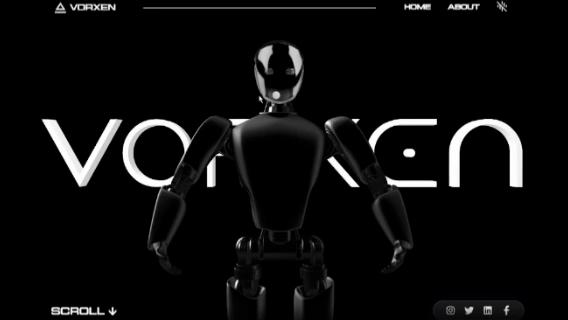

# 🤖 VORXEN - Robotic Innovation



> **VORXEN is not a website | it's an interactive AI interface.**  
> A futuristic web experience blending robotics, motion, and immersive UI.

---

## 🧠 Overview

VORXEN is a **futuristic, AI-inspired web interface** designed to feel like a living system rather than a static website.

It combines:  
- 🌌 Interactive galaxy environments  
- 🤖 Robotic / AI-inspired UI  
- 🎯 Custom cursor interactions  
- ⚡ Smooth motion & transitions  

---

## 🚀 Features

- 🧬 **Custom AI Cursor**  
  - Dynamic scaling  
  - Context-aware hover interactions  
  - Smooth GSAP-based trailing  

- 🌌 **Interactive Galaxy Background**  
  - Mouse interaction & repulsion  
  - Depth + motion simulation  

- ⚡ **Futuristic UI System**  
  - Glassmorphism panels  
  - Neon glow effects  
  - Minimal, high-tech typography  

- 🎞️ **Smooth Animations**  
  - Powered by GSAP & Motion  
  - Page transitions & staggered reveals  

- 🧠 **System-style About Page**  
  - Modular AI blocks  
  - Timeline evolution  
  - Interface-driven design  

---

## 🛠️ Tech Stack

- **React** — UI framework  
- **GSAP** — animations & transitions  
- **Motion** — interactive animations  
- **Spline** — 3D elements & scenes  

---

## 📁 Project Structure
```
src/
│
├── components/
│   ├── CountUp.jsx
│   ├── Cursor.jsx
│   ├── CurvedLoop.jsx
│   ├── Footer.jsx
│   ├── Galaxy.jsx
│   ├── Header.jsx
│   ├── ScrollVelocity.jsx
│   ├── SmoothScroll.jsx
│   ├── Socials.jsx
│   ├── SoundPlayer.jsx
│   ├── TiltedCard.jsx
│   ├── TransitionLink.jsx
│   └── TransitionWrapper.jsx
│
├── Pages/
│   ├── About.jsx
│   └── Home.jsx
│
├── App.jsx
├── index.css
├── main.jsx
├── index.html
├── package.json
├── package-lock.json
├── README.md
├── vite.config.js
└── .gitignore
```

---

## ⚙️ Installation

```bash
# Clone the repo
git clone https://github.com/Rizzwannndev/VERXON-Robotic-Innovation.git

# Go into the project
cd vorxen

# Install dependencies
npm install

# Run development server
npm run dev
```
## 🎯 Usage

- Move your mouse → interact with the custom cursor system  
- Hover elements → trigger AI-like feedback  
- Navigate pages → experience smooth transitions  
- Explore the About page → system interface design  

---

## 🧪 Future Improvements

- 🤖 AI voice interaction  
- 🌐 Full 3D environment (Three.js integration)  
- 🧠 Smart UI responses (state-driven animations)  
- 🎮 Interactive robotic models  

---

## 📄 License

MIT License